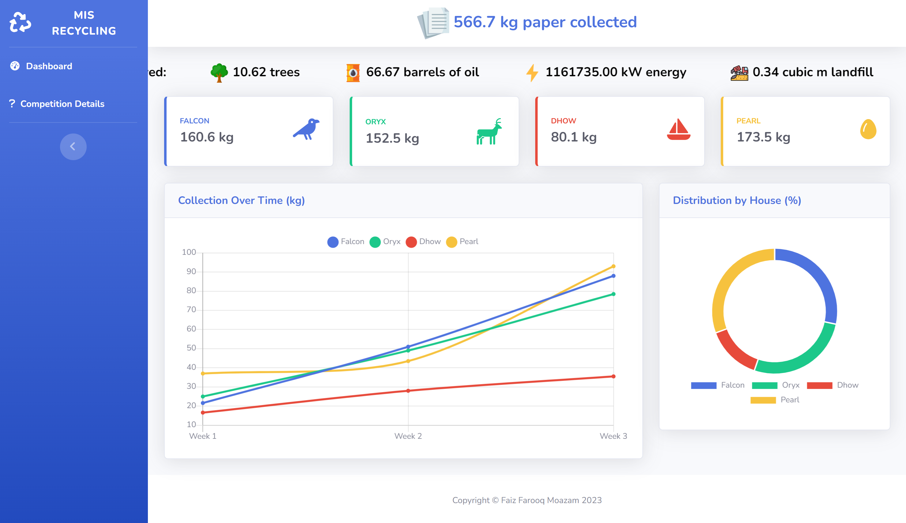

# MIS Recycling Competition Website

## :information_source: About
This repository contains the source code for the MIS Recycling Competition website. It displays the weight of paper collected per house and highlights performance over time.

The website uses javascript to dynamically display the results in charts, as well as calculate the resources saved, based on [published data](https://www.sccmo.org/863/Recycling-Facts).

Visit [Competition Details](https://faizfarooqmoazam.github.io/info.html) to see the competition rules and details.

The website is built using HTML, CSS (Bootstrap) and Javascript.

## :eyes: Preview

## [:link: Visit Website](https://faizfarooqmoazam.github.io/)

## :mag_right: References

Built with Bootstrap template, [SB Admin 2](https://startbootstrap.com/theme/sb-admin-2/), an open source admin dashboard theme for [Bootstrap](https://getbootstrap.com/) created by [Start Bootstrap](https://startbootstrap.com/).

